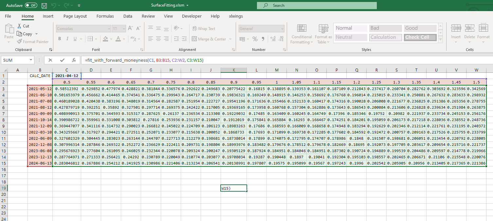
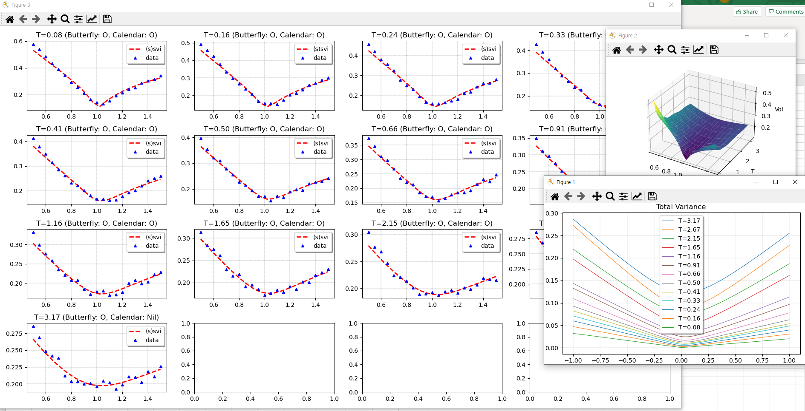
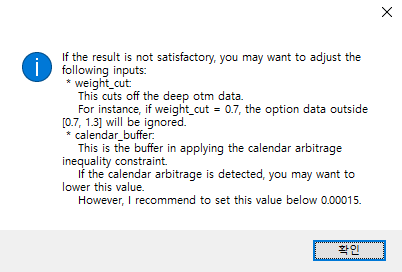
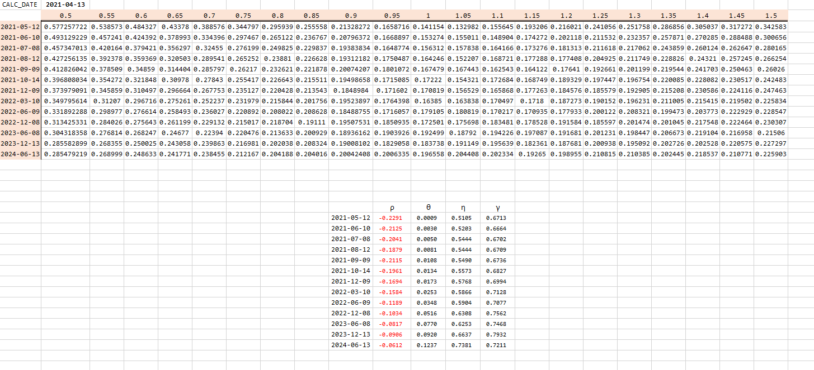

# SurfaceFitting
Fitting Volatility using SSVI with quotient phi, but by slice fitting fashion.

xlwings must be installed to utilize the python function as an UDF. 

## Setup
### Install xlwings
If you work on anaconda, xlwings may have been already installed. 
Otherwise, install it, for example by:
``` windows prompt
pip install xlwings
```
### Setup xlwings addin
If xlwings is installed. Hit the following command in windows prompt:
```
xlwings addin install
```
Then, in your VBA, add xlwings reference. In addition, in your xlwings addin, set the Python encironment as the absolute path and load the python function by clicking "Import Function".

## Usage
Now, you can use the fitting function in the excel work book:
```
=fit_with_forward_moneyness(C1, B3:B15, C2:W2, C3:W15)
```


The raw python function is as follow:
```
def fit_with_forward_moneyness(dt, dates, money, vol,
                               weight=True,
                               weight_cut = 0.5, calendar_buffer = 0.001,
                               vol_scale =1.0, 
                               max_iter = 10000):
```
The bool argument, weight, determines whether different weights are allocated over optimization.
Thus, if weight=False, weight_cut will not be used. 
If weight=TRUE, weight_cut = 0.6, the data outside strike <0.6, strike >1.4 will not be considered for calibration.
Moreover, if weight=True, ATM data has higher weight over OTM data.

The calendar_buffer argument is a buffer in constraint. This is for stability in vega matrix bumping.

If data comes in xx.xxx format (e.g., 24.33 or 15.22) set vol_scale = 0.01.

The argument max_iter means the maximal iteration number. 

## Results
You will see the graph of fitted slices, total variance, volatility surfaces:



Notice that the slice graph indicates if the arbitrage condition is satisfied.
If it does not work, you may need to manipulate the raw data or choose calibration parameters.

If you close all the graphs, a message will pops up:



Choose as your appetite. If you click "Yes", the udf will display the ssvi parameters:



## Note!
If you want to insert the result in database, modify the python code following your environment.
